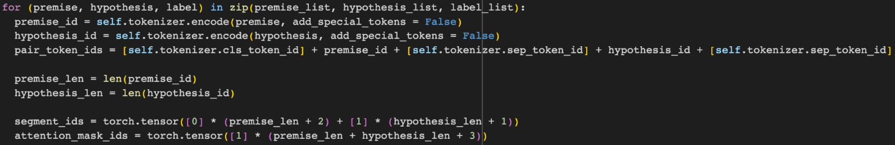

# 复现Bert下游任务MNLI

描述：Bert模型是NLP领域的里程碑模型，其在自然语言处理领域应用广泛，预训练的Bert模型经过下游任务微调之后，在不通数据集上都表现出相较其它同等模型的优势。在此次考核中，要求使用Bert-base模型，在MNLI数据集上完成下游任务处理，得到与公开数据匹配的精度。

## 1. 平台选择
基于Pytorch，transformers，transformers-adapter

方法一：手动freezing bert除最后一层参数 encoder.layer.11以外的所有参数，不使用Trainer

方法二：使用Adapter Hub中Prefix tuning和LoRA进行微调，使用Trainer

训练设备：T4，colab

## 2. 数据集准备

MNLI(The Multi-Genre Natural Language Inference Corpus, 多类型自然语言推理数据库)，自然语言推断任务。给定前提（premise）语句和假设（hypothesis）语句，任务是预测前提语句是否包含假设（蕴含, entailment），与假设矛盾（矛盾，contradiction）或者两者都不（中立，neutral）

数据下载方式：dataset = load_dataset(‘multi_nli’)

数据描述如下：

| Dataset           |Length |
| :------------------------ | :----: | 
| Training set              | 392702 |
| Matched validation set    | 9815   |
| Mismatched validation set | 9832   |

### 2.1 Freezing方法的数据处理

构建 MNLIDataBert，手动拼接输入：让输入对格式为 [CLS] {} [SEP] {} [SEP]，再整体进行encode
同时构建：segment tensor 和 mask tensor

如图：

2.2 基于Transformers Adapter模型对数据处理

利用map函数，对每一行数据对premise和hypothesis进行tokenization，进而得到'input_ids', 'attention_mask', 'labels'

 https://drive.google.com/file/d/1SGm8y6YRcmdl_FAl25v8yGydhZ2zmBg4/view?usp=drive_link
