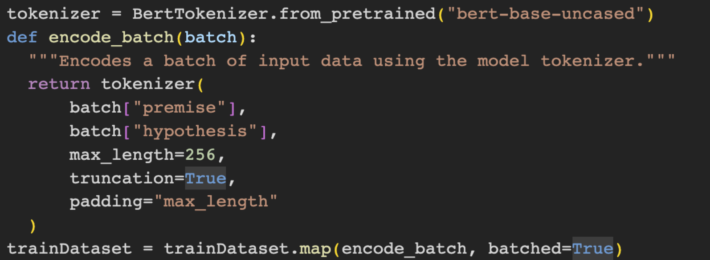
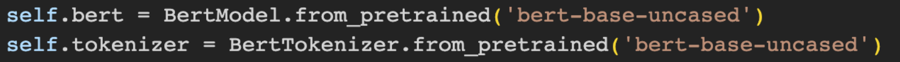
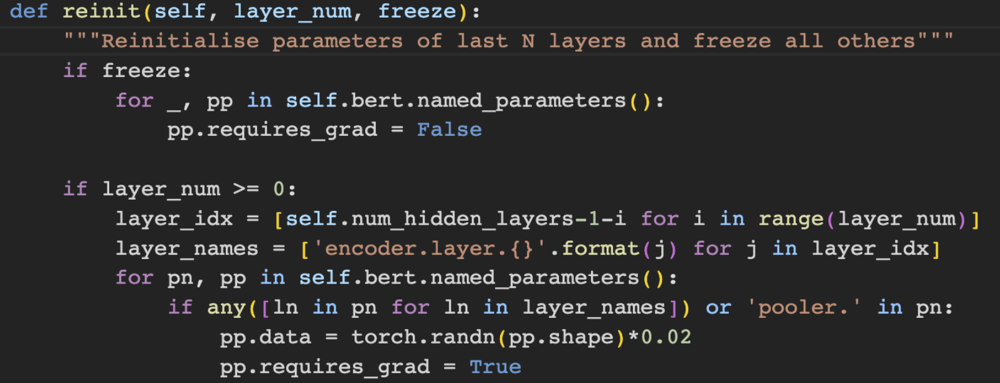
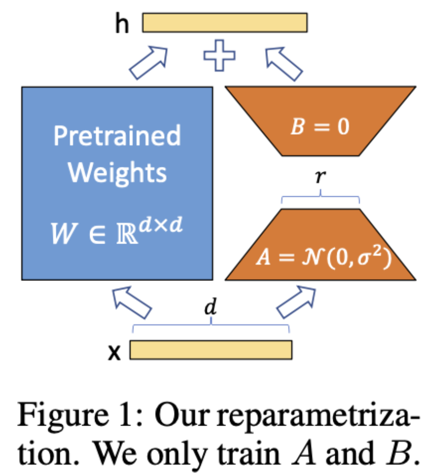
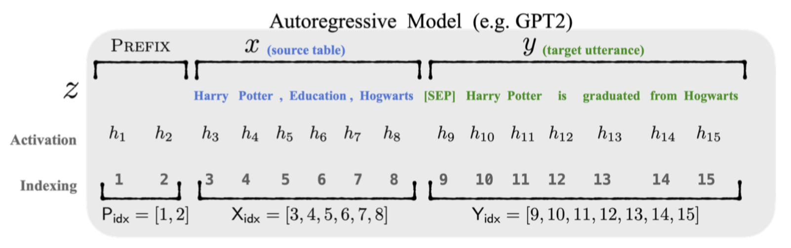

# 复现Bert下游任务MNLI

描述：Bert模型是NLP领域的里程碑模型，其在自然语言处理领域应用广泛，预训练的Bert模型经过下游任务微调之后，在不通数据集上都表现出相较其它同等模型的优势。在此次考核中，要求使用Bert-base模型，在MNLI数据集上完成下游任务处理，得到与公开数据匹配的精度。
注：由于模型weight比较大，如有需要可以从以下链接下载：

freeze：https://drive.google.com/file/d/1cKGNP6hSPW3oALA_-wv_ofLfInSEqeAf/view?usp=drive_link

LoRA：https://drive.google.com/file/d/1IQgci10ALckv7MBtER4I0zwn4EcyTwzm/view?usp=drive_link

prefix-tuning：https://drive.google.com/file/d/1SGm8y6YRcmdl_FAl25v8yGydhZ2zmBg4/view?usp=drive_link

## 1. 平台选择
基于Pytorch，transformers，transformers-adapter

方法一：手动freezing bert除最后一层参数 encoder.layer.11以外的所有参数，不使用Trainer

方法二：使用Adapter Hub中Prefix tuning和LoRA进行微调，使用Trainer

训练设备：T4，colab

## 2. 数据集准备

MNLI(The Multi-Genre Natural Language Inference Corpus, 多类型自然语言推理数据库)，自然语言推断任务。给定前提（premise）语句和假设（hypothesis）语句，任务是预测前提语句是否包含假设（蕴含, entailment），与假设矛盾（矛盾，contradiction）或者两者都不（中立，neutral）

数据下载方式：dataset = load_dataset(‘multi_nli’)

数据描述如下：

| Dataset                   | Length |
| :-----------------------: | :----: | 
| Training set              | 392702 |
| Matched validation set    | 9815   |
| Mismatched validation set | 9832   |

### 2.1 Freezing方法的数据处理

构建 MNLIDataBert，手动拼接输入：让输入对格式为 [CLS] {} [SEP] {} [SEP]，再整体进行encode
同时构建：segment tensor 和 mask tensor

如图：

### 2.2 基于Transformers Adapter模型对数据处理

利用map函数，对每一行数据对premise和hypothesis进行tokenization，进而得到'input_ids', 'attention_mask', 'labels'

## 3. 预训练模型参数准备

### 3.1 预训练模型均为：bert-base-uncased

### 3.2 微调方法

#### 3.2.1 Freezing

概述：加入额外的classifier —— Linear layer，以及softmax来得到3分类结果。使用函数 model.reinit(N) 来freeze除了倒数N层的其他weight

参数设置如下：

| Dataset              | Length  |
| :------------------: | :-----: | 
| batch_size           | 200     |
| epoch_num            | 1       |
| lr                   | 1e-4    |
| eps                  | 1e-6    |
| optimizer            | AdamW   |
| reinit_layers        | 1       |
| trainable parameters | 7680771 |

#### 3.2.2 LoRA

概述：在原始 PLM 旁边增加一个旁路，做一个降维再升维的操作，来模拟intrinsic rank。训练的时候固定 PLM 的参数，只训练降维矩阵A与升维矩阵B，而模型的输入输出维度不变，输出时将与 PLM 的参数叠加。论文仅有在MNLI上基于Roberta-based的实验结果，达到87.5的Accuracy。

论文：https://arxiv.org/pdf/2106.09685.pdf

参数设置如下：

| Dataset              | Length    |
| :------------------: | :-------: | 
| batch_size           | 64        |
| epoch_num            | 2         |
| optimizer            | AdamW     |
| lr                   | 1e-4      |
| eps                  | 1e-6      |
| r                    | 8         |
| alpha                | 16        |
| intermediate_lora    | False     |
| output_lora          | False     |
| trainable parameters | 887811    |

#### 3.3.3 Prefix Tuning

概述：在调节模型的过程中只优化一小段continuous task-specific vector（prefix）

论文：https://aclanthology.org/2021.acl-long.353.pdf

参数设置如下：

| Dataset              | Length    |
| :------------------: | :-------: | 
| batch_size           | 64        |
| epoch_num            | 2         |
| optimizer            | AdamW     |
| lr                   | 1e-4      |
| eps                  | 1e-6      |
| prefix_length        | 30        |
| trainable parameters | 10465283  |

## 4. 微调训练
详情请看.ipynb

注：由于初始GPU不够，故所有模型均分两次训练

Freezing方法：MNLI_BERT_freezeByhand.ipynb和MNLI_BERT_freezeByhand_second.ipynb

LoRA方法：MNLI_BERT_Adapter_LoRA.ipynb和MNLI_BERT_Adapter_LoRA_Prefix_second.ipynb

Prefix方法：MNLI_BERT_Adapter_Prefix.ipynb和MNLI_BERT_Adapter_LoRA_Prefix_second.ipynb

## 5. 整理训练loss和accuracy数据，与公开数据做对比

| Fine-Tuning Method  | Matched-Accuracy | Mismatched-Accuracy | Loss  |
| :-----------------: | :--------------: | :------------------:| :---: | 
| Freezing            | 0.742            | 0.740               | 0.671 |
| LoRA                | 0.754            | 0.769               | 0.621 |
| Prefix Tuning       | 0.784            | 0.796               | 0.520 |
| BERT Full Parameter | 0.845            | 0.848               | -     |
| Roberta-based LoRA  | 0.875            | 0.875               | -     |

总体问题：由于算力有限，无法达到同样训练轮次，无法使用batch size = 32来进行更新。

### 5.1 BERT全参数微调

Link: https://huggingface.co/ishan/bert-base-uncased-mnli

Bert全参数微调有1.13亿，参数量更大

### 5.2 Roberta-based LoRA微调

在BERT采用的数据BOOKCORPUS + English WIKIPEDIA（共16G）基础上，增加 CC-NEWS（76GB）、OPENWEBTEXT（38GB）、增加 STORIES（31GB），即RoBERTa一共用了160GB语料进行预训练。同时使用动态mask等技巧优化训练过程。

### 5.3 其他

其他在mnli数据集上做NLI任务的大模型，可以参考：https://paperswithcode.com/sota/natural-language-inference-on-multinli

